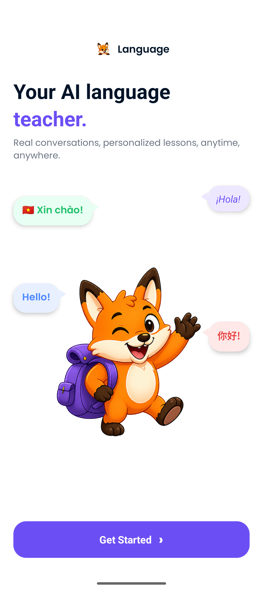
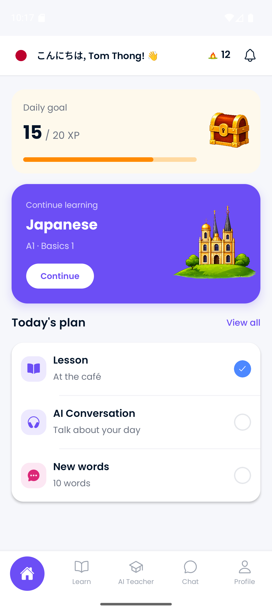
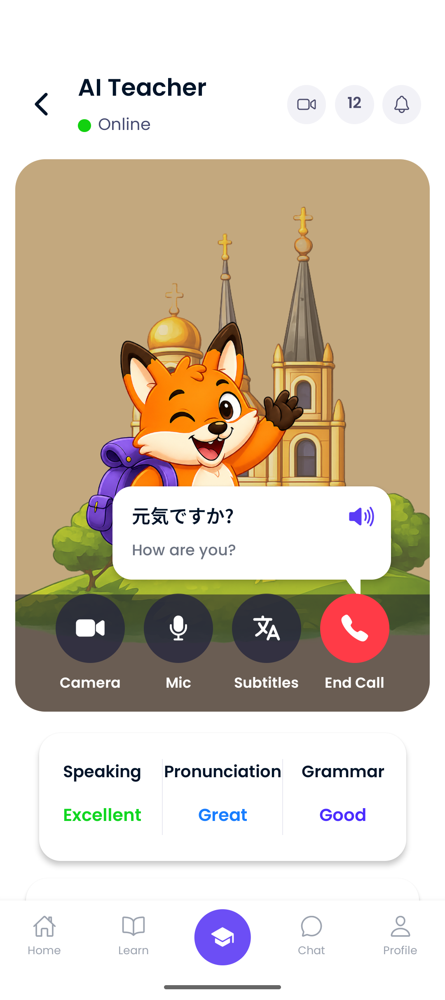

# Language — AI Language Learning App

An AI-powered mobile language learning app (like Doulingo) built with **React Native + Expo**. Practice real conversations with an AI teacher through live audio calls, track your daily learning goals, and progress through structured lessons across multiple languages.

---

## Screenshots

<table>
  <tr>
    <td align="center"><b>Welcome / Onboarding</b></td>
    <td align="center"><b>Home Dashboard</b></td>
    <td align="center"><b>AI Teacher (Audio Call)</b></td>
  </tr>
  <tr>
    <td></td>
    <td></td>
    <td></td>
  </tr>
</table>

---

## Features

### Onboarding & Authentication

- Welcome screen with animated mascot and multi-language greeting bubbles
- Email / password sign-up with email verification modal
- OAuth sign-in via **Google**, **Facebook**, and **Apple**
- Powered by **Clerk** — secure token storage with `expo-secure-store`

### Language Selection

- Choose from **Spanish**, **French**, **Japanese**, or **Vietnamese**
- Searchable language list showing learner counts
- Selection is persisted across sessions with **Zustand** + **AsyncStorage**

### Home Dashboard

- Personalized greeting with your first name and a greeting in your chosen language
- **Daily goal XP bar** — track your progress toward 20 XP per day
- **Continue Learning** card — jump back into your current lesson
- **Today's Plan** — AI Conversation, new vocabulary, and lesson activities
- 12-day streak counter

### Learn (Units & Lessons)

- Lessons organised into units per language (e.g., A1 · Basics 1)
- Lessons / Practice tab toggle
- Lesson cards show activity count, XP reward, and completion status (locked / not started / in progress / completed)
- 12 lessons across 4 languages (3 per language), each with vocabulary, phrases, multiple-choice, and translation activities

### AI Teacher (Core Feature)

- Real-time **audio call** with an AI language teacher via the **Stream Video SDK**
- Live captions for both teacher and learner — partial (real-time) and complete transcripts
- **Push-to-talk microphone** button with audio level feedback
- Call lifecycle: Idle → Loading → Ready → Connecting → Joined → Ended
- In-call feedback metrics: **Speaking**, **Pronunciation**, **Grammar**
- Lesson context card showing title, target phrases, and learning goals
- AI agent managed via backend vision-agent API (start / stop sessions)

### Profile

- User avatar from Clerk or generated initials fallback
- Display name, email address, and active language
- Quick link to change language
- Sign-out with confirmation

---

## Tech Stack

| Category           | Technology                                   |
| ------------------ | -------------------------------------------- |
| Framework          | React Native 0.81 + Expo ~54                 |
| Language           | TypeScript 5.9                               |
| Routing            | Expo Router ~6 (file-based)                  |
| Styling            | NativeWind 5 (Tailwind CSS for RN)           |
| Authentication     | Clerk (`@clerk/expo`)                        |
| Real-time Audio    | Stream Video React Native SDK                |
| WebRTC             | `@stream-io/react-native-webrtc`             |
| State Management   | Zustand 5                                    |
| Persistent Storage | AsyncStorage                                 |
| Navigation         | React Navigation 7 (bottom tabs)             |
| Analytics          | PostHog React Native                         |
| Fonts              | Poppins (Regular / Medium / SemiBold / Bold) |
| Icons              | `@expo/vector-icons` (Ionicons)              |

---

## Prerequisites

Make sure the following tools are installed before you begin:

- [Node.js](https://nodejs.org/) **v18 or later**
- [npm](https://www.npmjs.com/) v9+ or [yarn](https://yarnpkg.com/)
- [Expo CLI](https://docs.expo.dev/get-started/installation/)
- [Android Studio](https://developer.android.com/studio) (for Android emulator) or a physical Android device
- [Xcode](https://developer.apple.com/xcode/) (**macOS only**, for iOS simulator)

```bash
# Install Expo CLI globally
npm install -g expo-cli

# Verify Node version
node -v   # should be >= 18

# Install EAS CLI (optional, for production builds)
npm install -g eas-cli
```

---

## Setup

### 1. Clone the Repository

```bash
git clone https://github.com/tomnguyen103/MyFirstMobileApp.git
cd MyFirstMobileApp
```

### 2. Install Dependencies

```bash
npm install
```

> `patch-package` runs automatically via the `postinstall` script and applies any required dependency patches.

### 3. Configure Environment Variables

Create a `.env` file in the project root:

```bash
cp .env.example .env   # if an example file exists, otherwise create it manually
```

Open `.env` and fill in all required values:

```env
# Clerk — https://dashboard.clerk.com
EXPO_PUBLIC_CLERK_PUBLISHABLE_KEY=pk_test_xxxxxxxxxxxxxxxxxxxxxxxxxxxx

# PostHog — https://app.posthog.com
EXPO_PUBLIC_POSTHOG_KEY=phc_xxxxxxxxxxxxxxxxxxxxxxxxxxxx
EXPO_PUBLIC_POSTHOG_HOST=https://app.posthog.com

# Backend API base URL (leave empty when using Expo Go local dev server)
EXPO_PUBLIC_API_BASE_URL=https://your-backend-url.com
```

> **Never** commit your `.env` file. It is listed in `.gitignore`.

### 4. Set Up Third-Party Services

#### Clerk (Authentication)

1. Create a project at [dashboard.clerk.com](https://dashboard.clerk.com)
2. Enable **Email/Password**, **Google**, **Facebook**, and **Apple** sign-in methods
3. Copy the **Publishable Key** into `EXPO_PUBLIC_CLERK_PUBLISHABLE_KEY`

#### Stream (AI Audio Calls)

1. Create an app at [getstream.io](https://getstream.io)
2. Enable the **Video & Audio** product
3. Configure your backend to use the Stream API key and secret for generating tokens
4. Your backend exposes these endpoints used by the app:
   - `POST /api/stream/audio-call` — create an audio call session
   - `POST /api/vision-agent/start` — start the AI teacher agent
   - `POST /api/vision-agent/stop` — stop the AI teacher agent

#### PostHog (Analytics)

1. Create a project at [app.posthog.com](https://app.posthog.com)
2. Copy the **Project API Key** and **Host** into your `.env`

---

## Running the App

### Start the Development Server

```bash
npm start
# or
npx expo start
```

Then press one of the following keys in the terminal:

| Key | Action                             |
| --- | ---------------------------------- |
| `a` | Open on Android emulator / device  |
| `i` | Open on iOS simulator (macOS only) |
| `w` | Open in web browser                |
| `r` | Reload the app                     |
| `m` | Toggle developer menu              |

### Run on Android

```bash
npm run android
# or
npx expo run:android
```

### Run on iOS (macOS only)

```bash
npm run ios
# or
npx expo run:ios
```

### Run on Web

```bash
npm run web
# or
npx expo start --web
```

---

## Additional Commands

```bash
# Type-check the entire project
npm run typecheck

# Lint the codebase
npm run lint

# Reset to a blank Expo project (caution: moves current app/ to app-example/)
npm run reset-project
```

---

## Project Structure

```
MyFirstMobileApp/
├── app/                        # File-based routing (Expo Router)
│   ├── _layout.tsx             # Root layout — Clerk, PostHog, GestureHandler
│   ├── index.tsx               # Entry redirect (onboarding / language / tabs)
│   ├── onboarding.tsx          # Welcome screen with mascot
│   ├── language-selection.tsx  # Searchable language picker
│   ├── oauth-callback.tsx      # OAuth redirect handler
│   ├── (auth)/
│   │   ├── sign-up.tsx         # Email sign-up + verification modal
│   │   └── sign-in.tsx         # Email code sign-in + OAuth
│   ├── (tabs)/
│   │   ├── index.tsx           # Home dashboard
│   │   ├── learn.tsx           # Units & lessons browser
│   │   ├── ai-teacher.tsx      # AI audio call interface
│   │   ├── chat.tsx            # Coming soon
│   │   └── profile.tsx         # User profile & settings
│   ├── lesson/[id].tsx         # Dynamic lesson detail route
│   └── api/                    # Expo API routes (backend)
│       ├── _clerk-auth.ts
│       └── stream/audio-call+api.ts
│       └── vision-agent/{start,stop}+api.ts
│
├── components/                 # Reusable UI components
│   ├── CustomTabBar.tsx        # Bottom navigation bar
│   ├── LiveCaptionsCard.tsx    # Real-time caption display
│   ├── LoadingScreen.tsx       # Splash / loading state
│   ├── VerificationModal.tsx   # Email code verification dialog
│   └── GoogleIcon.tsx          # SVG Google logo
│
├── hooks/
│   ├── useStreamAudioCall.ts   # Stream SDK call lifecycle & captions
│   └── useLessonAnalytics.ts   # PostHog lesson event tracking
│
├── store/
│   ├── languageStore.ts        # Persisted selected language
│   └── lessonStore.ts          # Lesson progress state
│
├── data/
│   ├── languages.ts            # Supported languages list
│   ├── lessons.ts              # Lesson definitions & AI prompts
│   ├── units.ts                # Unit groupings per language
│   └── todaysPlan.ts           # Daily plan activity items
│
├── lib/
│   ├── api.ts                  # API URL resolution helper
│   ├── stream.ts               # Stream & vision-agent API calls
│   └── analytics.ts            # PostHog identify & event helpers
│
├── types/
│   └── learning.ts             # Language, Lesson, Unit, Activity types
│
├── assets/
│   ├── images/                 # App graphics & mascot illustrations
│   └── fonts/                  # Poppins font family (TTF)
│
├── app.json                    # Expo app configuration
├── package.json
├── tsconfig.json
├── metro.config.js
├── global.css                  # Global Tailwind/NativeWind styles
└── postcss.config.mjs
```

---

## App Workflow

```
Launch
  └── index.tsx
        ├── First time?  → Onboarding → Language Selection → Sign Up / Sign In
        └── Returning?   → (Tabs)
                              ├── Home       — daily goal & lesson progress
                              ├── Learn      — units & structured lessons
                              ├── AI Teacher — live audio call with AI agent
                              ├── Chat       — (coming soon)
                              └── Profile    — settings & sign out
```

---

## Building for Production

```bash
# Install EAS CLI
npm install -g eas-cli

# Log in to your Expo account
eas login

# Configure the project (first time only)
eas build:configure

# Build for Android (APK / AAB)
eas build --platform android

# Build for iOS (IPA)
eas build --platform ios

# Submit to stores
eas submit --platform android
eas submit --platform ios
```

---

## Contributing

1. Fork the repository
2. Create a feature branch: `git checkout -b feature/your-feature-name`
3. Commit your changes: `git commit -m "feat: add your feature"`
4. Push to the branch: `git push origin feature/your-feature-name`
5. Open a Pull Request against `main`

---

## License

This project is for educational and portfolio purposes.
